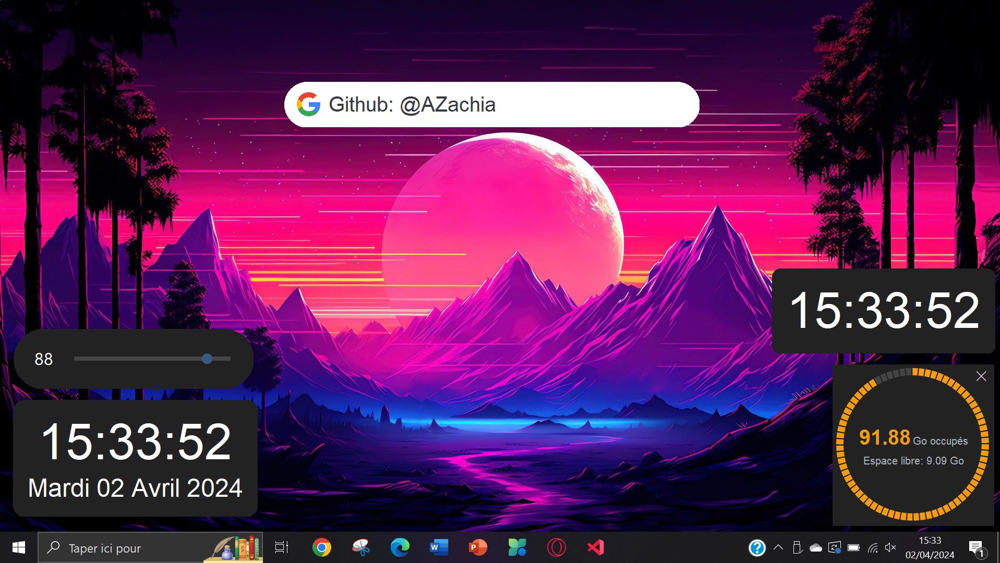

# Windows-Widgets
 

A collection of beautifull and modern windows widgets written in python with tkinter



## Installation
To install the widgets, you have to clone the repository and copy the `widgets` folder to your project directory.

You can download in in zip format and extract it to your project directory or run the following command in your project directory:

```bash
git clone https://github.com/AZachia/Windows-Widgets.git && cd Windows-Widgets
```

## Usage
To run one widget especially, you just have to run it as a script.

## Create your own widget
To create your own widget, you have to create a new python file in the `widgets` folder and create a class that inherits from `widget.widget`:

```python
from widget import widget

class MyWidget(widget):
    def __init__(self, master, **kwargs):
        super().__init__(master, **kwargs)
        # Your code here

if __name__ == "__main__":
    MyWidget().app.mainloop()
```

for example, to display a simple window with a label, you can do:

```python
from widget import widget
import tkinter as tk

class HelloWidget(widget):
    def __init__(self, master, **kwargs):
        super().__init__(master, **kwargs)
        self.label = tk.Label(self.app, text="Hello, World!", font=("Arial", 20))
        self.label.pack(padx=30, pady=30)

if __name__ == "__main__":
    HelloWidget().app.mainloop()
```
